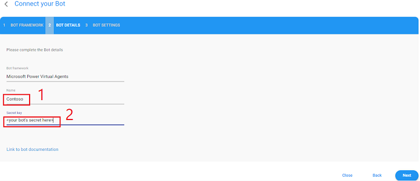

# PVA / AudioCodes Contact Center Accelerator

The goal of a modern contact center solution is to provide a customer experience that rivals
that of an experienced human agent and do that at scale and at a fraction of the cost of a
traditional contact center.  Achieving that goal requires a solution that can transform
conversation into a coordinated business process that weaves together a core set of solution
elements to respond effectively. This solution accelerator provides the building blocks and
blueprint for how to use Power Virtual Agent and AudioCodes VoiceAI Connect Cloud Edition
to build a modern contact center assistant.

## Modern Contact Center Solution

A modern contact center solution involves the effective integration of the key systems and
services shown in **Figure 1**. The primary goal of this accelerator is to identify these
systems and services and show how each can be effectively integrated into a modern contact
center solution to provide maximum capability. To accomplish this goal, the accelerator
includes a set of building blocks and blueprints that address common contact center tasks
and scenarios.  You can think of the systems and services in **Figure 1** as sort of a
checklist of key topic areas you need to give careful consideration in order to build an
effective modern contact center solution.  
&nbsp;  
  
&nbsp;  
**<a name="HighLevelSubsystemOverview"></a>Figure 1: Contact Center Core Elements**  

## &nbsp;  

## Table of Contents  
[SOLUTION OVERVIEW](#SolutionOverview)  
[PREREQUISITES](#Prerequisites)  
&nbsp;&nbsp;&nbsp;&nbsp;&nbsp;&nbsp;Required Skills  
&nbsp;&nbsp;&nbsp;&nbsp;&nbsp;&nbsp;Demo-Only Prerequisites  
&nbsp;&nbsp;&nbsp;&nbsp;&nbsp;&nbsp;Development Prerequisites  
[Getting Started](#GettingStarted)  
&nbsp;&nbsp;&nbsp;&nbsp;&nbsp;&nbsp;Clone the PVA/AudioCodes Contact Center Repo  
&nbsp;&nbsp;&nbsp;&nbsp;&nbsp;&nbsp;Deploy Mock Services  
&nbsp;&nbsp;&nbsp;&nbsp;&nbsp;&nbsp;Import, Configure & Publish the PVA / AudioCodes Solution  
&nbsp;&nbsp;&nbsp;&nbsp;&nbsp;&nbsp;Telephony Configuration  
[Using the Accelerator](#UsingTheAccelerator)  
[Best Practices](#BestPractices)

## <a name="SolutionOverview"></a>Solution Overview

In the context of a contact center, two disciplines weave each of the various solution
elements in **Figure 1** together and bring them alive: conversational AI and telephony.
In this accelerator, the conversational AI discipline is provided by Microsoft's Power
Virtual Agent (PVA) and telephony is provided by AudioCodes VoiceAI Connect Cloud
(VAIC-C). **Figure 2** provides an architectural understanding of how those two
technologies fit together along with the other elements of the accelerator.  In this
initial version of the accelerator, only four of the seven core elements of 
**Figure 1** are addressed: Contact Center Assistant, Experiences, Customer Services,
and Line of Business Integration.  The other three will be addressed as this
accelerator evolves.

  
**<a name="HighLevelSolutionOverview"></a>Figure 2: Accelerator Architecture Diagram**  

## <a name="Prerequisites"></a>Prerequisites
#### Required Skills
If this accelerator is going to be used as a telephony demonstration, then only a
basic understanding of Microsoft's Power Virtual Agent (PVA) is required and the
instructions for configuring AudioCode's VoiceAI Connect Cloud (VAIC-C) should be
enough to accomplish the task without any prior knowledge.

If this accelerator is going to be used to accelerate the development and
deployment of a modern contact center solution, then a good working knowledge
of PVA and VAIC-C will be required for tasks that involve creating and extending
PVA Topics, PVA Composer Topics, Power Automate Flows, Azure Functions, and
understanding the various VAIC-C capabilities and how to integrate them.  If you
are new to PVA and/or AudioCodes VoiceAI Connect, this accelerator can be very
helpful in getting you up to speed with less effort since you'll start with an
assistant that has an implementation that you can examine and extend so you
aren't starting from first principles.

#### Demo-Only Prerequisites
You don't need to be a developer or have development tools installed in order to
get this accelerator up and running and demo it but you will if you wanted to
modify and extend this accelerator (see [Development Tools](#ForDevelopers) section
for details). The only thing you need to run this accelerator and try it out is
access to Microsoft's Power Virtual Agent and AudioCodes VoiceAI Connect Cloud
Edition. If you don't already have access to either of those services, you can
create a trial account to explore those services and this accelerator.

**Note:** The trial subscription for AudioCode VoiceAI Connect Cloud provides a
standard set of telephony features but some of the capabilities of this accelerator
use advanced telephony capabilities which require the AudioCodes VoiceAI Connect
Cloud Edition Plus and you can upgrade your trial subscription later if you want
to leverage those features without having to reinstall the accelerator.  

- **Get PVA Trial Account**  
To sign up for a free trial account for Power Virtual Agents click [here](https://go.microsoft.com/fwlink/?LinkId=2107702&clcid=0x409&cmpid=pva-home-hero-sta-buildchatbots)

- **Get AudioCodes Trial Account**  
Follow the instructions [here](https://techdocs.audiocodes.com/voice-ai-connect/#VAIG_Cloud/signing_up_to_cloud.htm?TocPath=VoiceAI%2520Connect%2520Cloud%257C_____2)
to sign up for a free trial account for AudioCodes Voice AI Connect Cloud
Edition.  
&nbsp;  
Alternatively, you can also subscribe to AudioCodes Voice AI Connect Cloud
Edition from Azure Market Place by following the instructions [here](https://techdocs.audiocodes.com/voice-ai-connect/#VAIG_Combined/Accessing%20VoiceAi%20Connect%20Cloud%20from%20Azure.htm?TocPath=VoiceAI%2520Connect%2520Cloud%257C_____1)  
&nbsp;  
When you've successfully created a trial account, confirmed your account, and
successfully signed in, you can stop there and will come back to this AudioCodes
portal later in the [Telephony Configuration step](#TelephonyConfiguration)  
- **Get PowerShell**  
To make it as easy as possible to get started quickly, a PowerShell script is
used in the **Getting Started** steps to install and configure various Azure
services so you don't have to worry about those details and the accelerator
will just work when you're finish setup.  
&nbsp;  
You'll need to download and install PowerShell [here](https://docs.microsoft.com/en-us/powershell/scripting/install/installing-powershell-on-windows?view=powershell-7.2#msi)
if you don't already have that installed.

#### <a name="ForDevelopers"></a>Development Prerequisites  
In addition to the demo-only prerequisites, if you want to explore or extend the
more advanced and technical aspects of this accelerator, you'll need to install
the following tools.  
- **Install Bot Framework Composer**  
This accelerator extends its Power Virtual Agent by using Bot Framework Composer
and you'll need to install it if you want to explore or modify those
extensions.  Download Composer ***for Windows*** [here](https://docs.microsoft.com/en-us/composer/install-composer?tabs=windows#download-composer)

- **Install Visual Studio**  
If you want to explore the mock Customer Service Azure Function or if you
installed Composer to explore or extend PVA Composer Topics, you'll also
need to install Visual Studio which can be installed [here](https://docs.microsoft.com/en-us/visualstudio/install/install-visual-studio?view=vs-2022)

## <a name="GettingStarted"></a>Getting Started
Getting started should be quick and easy and there are only four steps you
need to complete which are easy enough to follow that you shouldn't need
any prior knowledge to be successful.  Alternatively, this short
[Getting Started Screencast](https://aka.ms/pva-vaicc-start) covers the
same ground, but in video form which can be easier and quicker to
follow for this type of activity.

#### 1) **Clone the PVA/AudioCodes Contact Center Repo**  
>This repo has everything you'll need to get the solution up and running and
to get started you'll need to clone the repo which copies the accelerator
to your local device.  If you have [Git](https://git-scm.com/downloads)
installed, create a folder to clone the accelerator in and open a PowerShell
command window with its current working directory set to the folder you
just created and then enter the following console command:  
&nbsp;  
```git clone https://github.com/managedcoder/PVAAudioCodesCC```  
&nbsp;  
If you don't have Git installed then you can scroll to the top of this
page and click the green Code button and download a zip archive of this
repo and extract it into a working folder.  

#### 2) **Deploy Mock Services**  
>In order to capture realistic enterprise scenarios for a modern contact
center, this accelerator implements mock services and hosts sample audio
logo files.  To make it as easy as possible to get up and running quickly
without having to understand the technical details of the accelerator, a
single PowerShell script is provided that will deploy and configure these
mock services and all you'll need to do is run it.  
&nbsp;  
Open a Power Shell command window with its current working directory set
to the **Deployment** project folder and sign into your Azure subscription
if you haven't already  
&nbsp;  
```az login```  
&nbsp;  
Running the following command will deploy the mock services used by this
accelerator.  You can delete these services once they've served their
purpose of providing an explicit blueprint/roadmap for building a modern
contact center.  
&nbsp;  
```.\deploy.ps1 -name "<name>" -location "<region>"```  
&nbsp;  
Where:  
**```<name>```** is the name to use to deploy the accelerator's mock
services.  For example, you could use some form of your contact center
assistant's name using letters and numbers that's between 3 and 24
characters long (e.g., ```"ContosoMockServices"```).  
**```<region>```** is the Azure region where the mock services will
be deployed (e.g., ```"eastus"```).  
&nbsp;  
The deployment generally only takes about a minute to complete and when
it's done you'll see two important configuration settings in yellow that
you'll need to come back and copy later when you get to the configuration
step for your contact center assistant.  
&nbsp;  
**Note:** If there are errors during deployment, you'll see them in the
command window and more detailed error information will be written to a
log file named deploy_log.txt.

#### 3) **Import, Configure & Publish the PVA / AudioCodes Solution**  
>The accelerator's contact center assistant has been shared as a Power
Virtual Agent solution that will need to be imported into your Power
Apps environment.  
&nbsp;  
***Import Solution***  
Browse to the [PVA portal](http://powerva.microsoft.com/) and click the
"settings" gear icon in the top right and then click "General Settings"
link.  In the resulting Setting dialog, click the "Go to Power Apps
Solutions"  
&nbsp;  
  
&nbsp;   
In Power Apps portal, click the "Import" link at top of page and then
click the "Browse" button and select
PVAAudioCodesContactCenterAccelerator_1_0_0_0.zip which you'll find in
the root folder of the accelerator you cloned/extracted in step 1. Then
click "Next" and "Import".
&nbsp;  
  
&nbsp;  
**Note:** If you're having trouble importing the solution, you can find more
detailed instructions [here](https://docs.microsoft.com/en-us/power-virtual-agents/authoring-export-import-bots#import-the-solution-with-your-bot)
or watch [this short video](https://www.microsoft.com/en-us/videoplayer/embed/RE4CsHl?postJsllMsg=true)
and skip to the 1:48 minute mark where it shows how to import a solution.  
&nbsp;  
***Open Solution***  
Open the [PVA portal](https://web.powerva.microsoft.com) in a new browser
window (or refresh the portal if it's already open) and open the imported
assistant by clicking on the bot icon in the upper right corner of the page
and choose your assistant from the menu.  
&nbsp;  
  
&nbsp;  
<a name="ConfigureYourAssistantsGreeting"></a>***Configure Your Assistant's Greeting***  
To connect your contact center assistant to the accelerator's mock
services, there is a simple configuration step you'll need to complete.  
&nbsp;  
Click the **Topics** tab in the left navigation and find the **Greeting**
topic in the list of Topics (use Search box if needed) and click on it
to open it.  There are three values you'll need to set in the **Redirect**
action for **configureMockSettings**.  Replace the placeholder text in the
**customerServiceHostURL** and **audioLogoURL** fields with the
corresponding values displayed in yellow text at the end of the
deployment in the deployment command window. For the **agentPhoneNumber**
setting you can use the phone number you would like the assistant to call
when agent escalation occurs.  The number should start with the country
code which in the US is "1" so the number would look something like
15554441212.  There are several places in the building blocks and
scenarios that escalate to an agent and when that happens the phone number
you provide in this setting will be called. Using your cell phone number
is a convenient way to test and demo this.  
&nbsp;  
  
&nbsp;  
Copy the text highlighted with red boxes from the command window you
used to deploy the mock services and paste it into the corresponding
fields as described above.  
&nbsp;  
Finally, click **Save** in upper right of page.  
&nbsp;  
  
&nbsp;  
***Set Security for Your Assistant***  
Set the security level of your assistant by clicking the **Manage** tab in
the left navigation menu and then click the **Security** menu option and
then click the **Authentication** option  
&nbsp;    
  
&nbsp;  
For the purposes of getting started you can choose **No Authentication**
and click **Save** and then click **Close**
&nbsp;  
  
&nbsp;  
***Publish Your Assistant***  
Finally, publish your assistant by clicking the **Publish** tab in the
left navigation menu and then click the **Publish** button  
&nbsp;    
  
#### 4) <a name="TelephonyConfiguration"></a>**Telephony Configuration**  
>Configuring the telephony aspect of the solution accelerator involves
working in AudioCodes VoiceAI Connect Cloud portal.  You can follow
the instructions in this step or follow the instructions [here](https://techdocs.audiocodes.com/voice-ai-connect/#VAIG_Cloud/ms_power_va.htm?TocPath=VoiceAI%2520Connect%2520Cloud%257CCreating%2520your%2520bot%2520using%2520Bot%2520Integration%2520wizard%257C_____1)
to create a telephony bot connection.  
&nbsp;  
***Create a Bot Connection***  
Open the [AudioCodes portal](http://voiceaiconnect.audiocodes.com/)
in the browser sign in and if this is the first time you've visited
the AudioCodes portal, it will look like the screen below and you'll
select the **Connect your bot to phone number provided by AudioCodes**
wizard and then the screens from that point on will match starting with
the selection of **Microsoft Power Virtual Agent** as the next step.
&nbsp;  
  
&nbsp;  
If this is not the first time you've signed in to the AudioCodes portal,
then the screen will look like the screen below and you should click
the plus sign.  
&nbsp;  
  
&nbsp;  
Select **Microsoft Power Virtual Agents** framework and click **Next**  
  
&nbsp;  
***Bot Details Tab***  
On the Bot Details tab, enter a name for the bot connection in
AudioCodes then enter the PVA Bot's secret which you can find by 
following [these instructions](https://docs.microsoft.com/en-us/power-virtual-agents/configure-web-security#obtain-the-secrets)
and then click **Next**  
&nbsp;  
  
***Bot Setting Tab***  
The default values of the Bot Settings tab are fine and don't need to
be changed so you can click **Create**  
&nbsp;  
  
&nbsp;  
***Enable Bot Features***  
Once you've created a bot connection, you can edit it's features
and enable capabilities that the accelerator is pre-wired to take
advantage of.  Switch to the **Bots** tab and click **Edit** on the
bot connection you created.  
&nbsp;  
  
&nbsp;  
Click on the **Features** tab and then enable outbound calling,
call recording controlled by bot, and call transfer and then
click **Update**.  
&nbsp;  
These features are not available with the basic trial subscription
and, although the majority of the accelerator's building blocks and
scenarios work with the trial subscription, if you want demo or
extend those aspects of the accelerator, you'll need to upgrade to
the **Essential Plan** in lower left of dialog.  
&nbsp;  
**Note:** The agent escalation capability requires the **call
transfer** feature to be enabled so if escalation happens while
you are experimenting or demoing, you'll hear a message that says,
"Hello, welcome to AudioCodes VoiceAI Connect, the number you've
dialed is not connected to a root...".  
&nbsp;  
  
&nbsp;  
***Provision a Phone Number***  
&nbsp;  
Next, you'll provision the phone number for your assistant. Click on
the **Numbers** tab in the menu on the left and click the
**plus sign** and choose a country, state, and city and click
**Add Number** and then **Finish**.  
&nbsp;  
  
&nbsp;  
***Connect Your Bot to Phone Number***
&nbsp;  
Now you can connect your bot to the phone number you just provisioned.
Click the **Wizard** button in lower left and then click **Select**
button on the **Connect your bot to phone number provided by
AudioCodes** wizard option and then select your bot from the list and
click **Next**.  
&nbsp;  
  
&nbsp;  
***Select Existing Phone Number***  
On the **SELECT PHONE NUMBER** screen, choose **Use existing number** then select your provisioned number
and click **Next**  
&nbsp;  
  
&nbsp;  
You can take all the defaults on the **CREATE ROUTING RULES** page
and select **Create**  
&nbsp;  
  
&nbsp;  
***Call Your Assistant!!!***  
&nbsp;  
Congratulations!  You are now ready to call your bot and when you
do, you should hear an audio logo and then the assistant's greeting.  
&nbsp;  
If the number isn't working yet or AduioCodes says it not ready,
then give it a minute and try again.  
&nbsp;  
*****Trouble Shooting*****  
If you hear a message that says, "To use this bot, publish it in
Power Virtual Agents...", check to make sure that you have published
the bot in the [Power Virtual Agent portal](https://powerva.microsoft.com/).  
&nbsp;  
If you hear a message that says, "The accelerator needs to be
configured before its ready to take calls.  Instructions can be found
in the README documentation." then you'll need to review
[this section of Step 3](#ConfigureYourAssistantsGreeting) and
replace the placeholder values with the correct ones.  


## <a name="UsingTheAccelerator"></a>Using the Accelerator

Think of this accelerator as part construction kit and part roadmap where its building
blocks and scenarios allow you to minimize time-to-value and maximize solution
capability.
 
**Building Blocks** - The accelerator includes a set of executable how-to's that
provide "implementation snippets" for various common contact center tasks.  You can use
them "as is" or tailor and extend them to meet the needs of your solution.  
**Scenarios** - The scenarios included in the accelerator are example implementations
of common contact center scenarios like "order status" or "product trouble
shooting".  
**Best Practices** - Finally, the best practices discuss important contact center
topics and provide insight and effective approaches for addressing contact center
challenges.

The accelerator is spread across several portals and a number of assets so we've
created [this video](https://aka.ms/pva-vaicc-tour) to help you understand what's
included in the accelerator and how to use it effectively.

## <a name="BestPractices"></a>Best Practices
As this accelerator evolves, this section will capture and discuss important
contact center topics and common challenges and provide insight and effective
approaches for addressing them.

### <a name="Gotchas"></a>Gotcha's To Be Aware Of
- **Version Confusion** - Use version numbers in PVA and Composer
Topics so you can ask for them when you test your contact center
assistant.  Anytime you change a Composer topic you will need to
1) refresh the PVA portal page and 2) republish your contact center
assistant, otherwise, AudioCodes VoiceAI Connect Cloud (VAIC-C) will
still be pointing to the last published version.  Even more
confusing is that the Test Panel in the PVA portal works fine since
it points to the most up-to-date unpublished version.

- More to come soon!

### <a name="AddOrExtendComposerTopics"></a>Add or Extend Composer Topics  
Coming soon!

### <a name="TelephonyUserExperienceChallengesAndBestPractices"></a>Telephony User Experience Challenges and Best Practices  
Coming soon!

### <a name="CapturingCustomerInsight"></a>Capturing Customer Insight  
Coming soon!

### <a name="MultiModalCustomerEngagement"></a>Multi-modal Customer Engagement  
Coming soon!

## Contributing

This project welcomes contributions and suggestions.  Most contributions require you to agree to a
Contributor License Agreement (CLA) declaring that you have the right to, and actually do, grant us
the rights to use your contribution. For details, visit https://cla.opensource.microsoft.com.

When you submit a pull request, a CLA bot will automatically determine whether you need to provide
a CLA and decorate the PR appropriately (e.g., status check, comment). Simply follow the instructions
provided by the bot. You will only need to do this once across all repos using our CLA.

This project has adopted the [Microsoft Open Source Code of Conduct](https://opensource.microsoft.com/codeofconduct/).
For more information see the [Code of Conduct FAQ](https://opensource.microsoft.com/codeofconduct/faq/) or
contact [opencode@microsoft.com](mailto:opencode@microsoft.com) with any additional questions or comments.

## Trademarks

This project may contain trademarks or logos for projects, products, or services. Authorized use of Microsoft 
trademarks or logos is subject to and must follow 
[Microsoft's Trademark & Brand Guidelines](https://www.microsoft.com/en-us/legal/intellectualproperty/trademarks/usage/general).
Use of Microsoft trademarks or logos in modified versions of this project must not cause confusion or imply Microsoft sponsorship.
Any use of third-party trademarks or logos are subject to those third-party's policies.
